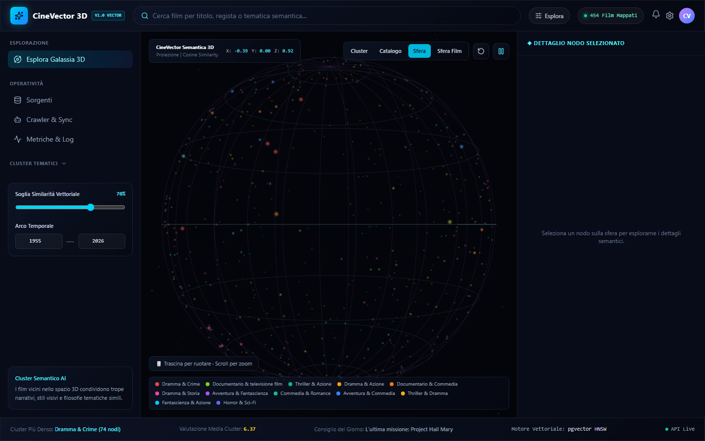
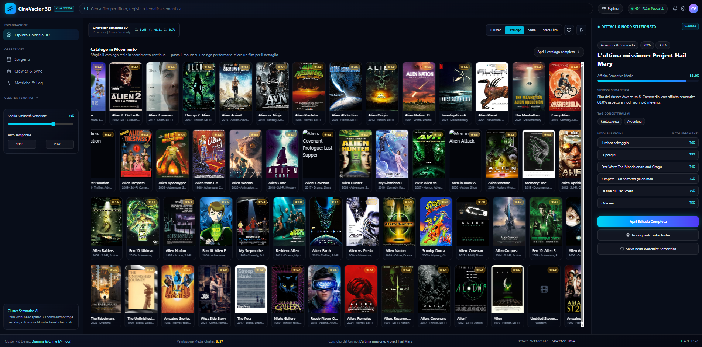
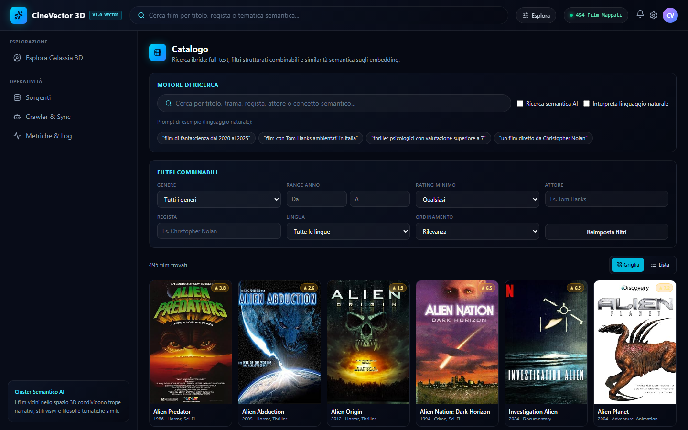
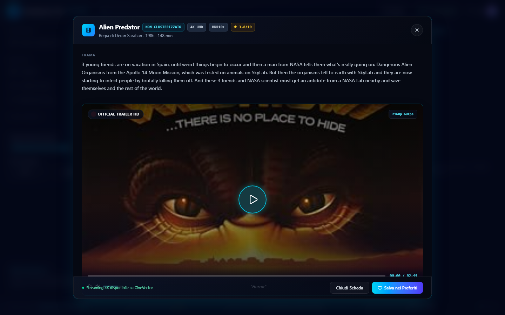
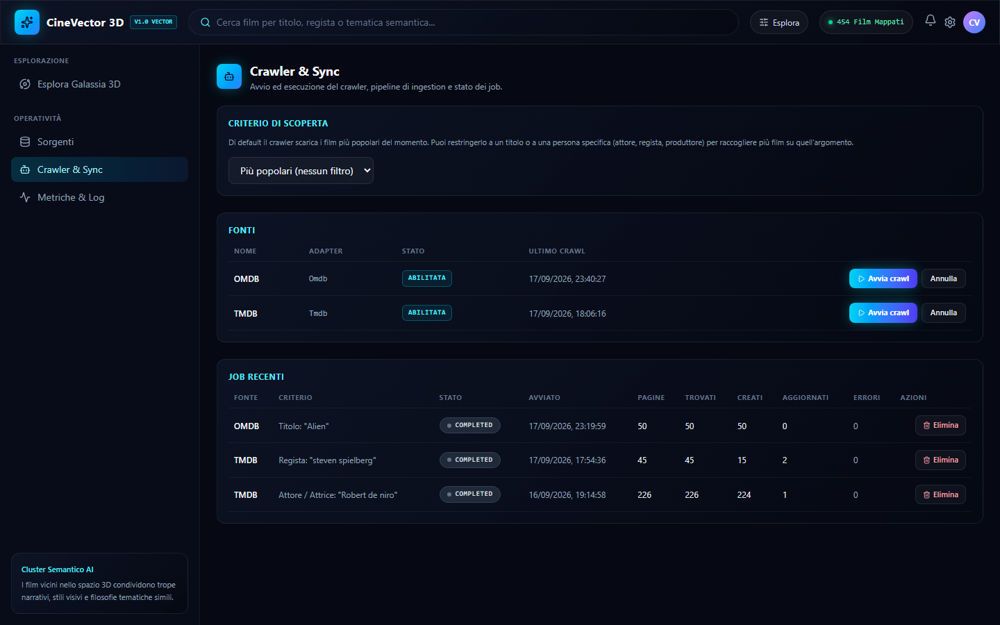
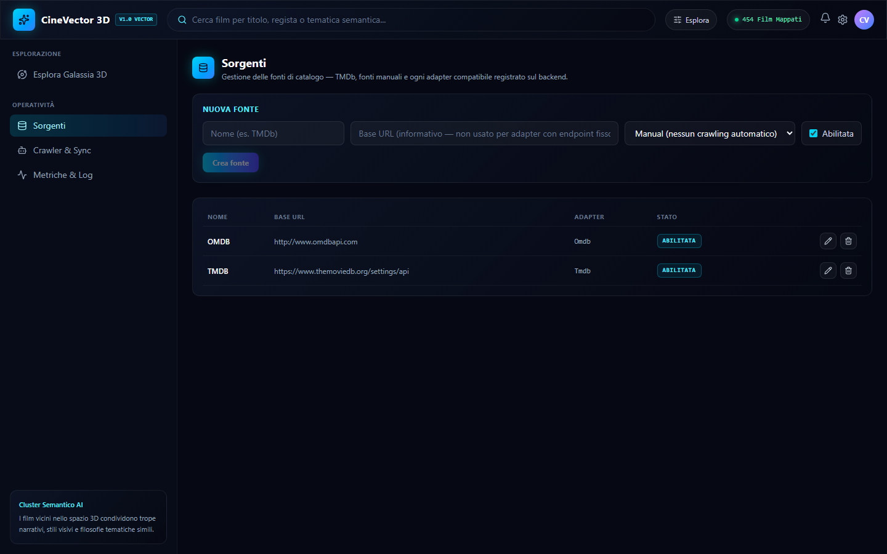
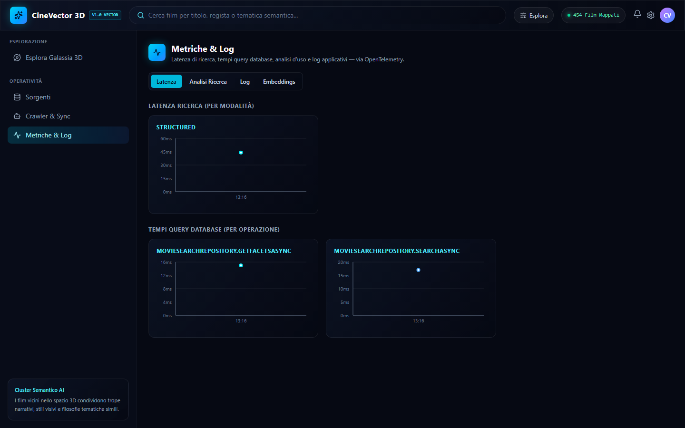
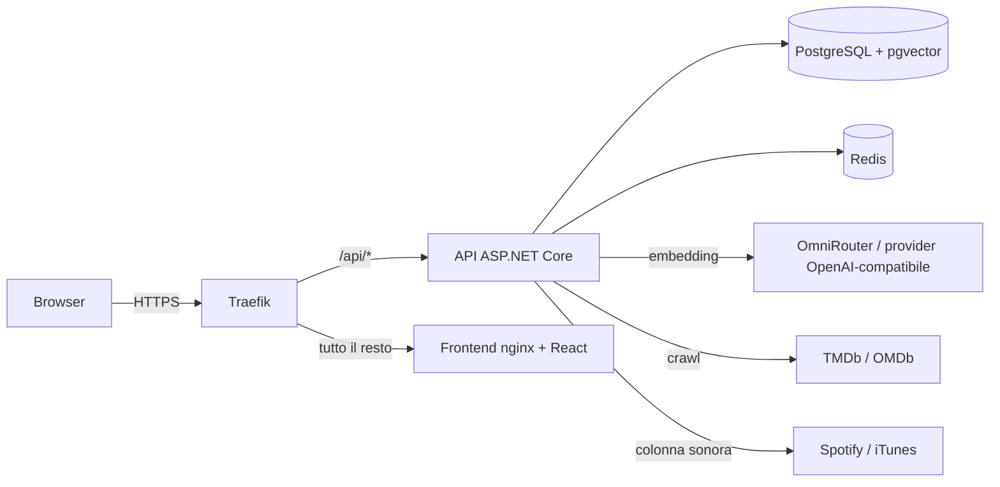

# CineVector

Catalogo cinematografico con **ricerca semantica**. CineVector raccoglie i metadati dei film da fonti pubbliche (TMDb, OMDb), ne calcola un *embedding* vettoriale e li rende esplorabili in tre modi: una **sfera 3D** in cui i film simili stanno vicini, un **catalogo** con ricerca ibrida (full-text + semantica + filtri) e una **ricerca in linguaggio naturale** («film di fantascienza dal 2020 al 2025»).

Non c'è alcuna funzionalità di streaming o download: i link portano sempre e solo alle pagine pubbliche delle fonti.



## Indice

- [Cosa fa](#cosa-fa)
- [Schermate](#schermate)
- [Architettura](#architettura)
- [Struttura del repository](#struttura-del-repository)
- [Sviluppo locale](#sviluppo-locale)
- [Configurazione](#configurazione)
- [Deploy in produzione (Hostinger + Traefik)](#deploy-in-produzione-hostinger--traefik)
- [Database e migration](#database-e-migration)
- [Manutenzione](#manutenzione)
- [Riferimento API](#riferimento-api)
- [Come funziona](#come-funziona)
- [Test](#test)
- [Sicurezza: leggere prima di pubblicare](#sicurezza-leggere-prima-di-pubblicare)
- [Risoluzione problemi](#risoluzione-problemi)

## Cosa fa

- **Esplora Galassia 3D**: i film sono punti su una sfera, proiettati dal loro embedding (PCA a 3 dimensioni) e colorati per cluster tematico. Quattro viste: *Cluster*, *Catalogo*, *Sfera* e *Sfera Film* (con i poster, zoom libero). Filtri per soglia di similarità e arco temporale.
- **Catalogo con ricerca ibrida**: full-text PostgreSQL, ricerca semantica opzionale e filtri combinabili (genere, anni, rating minimo, attore, regista, lingua). Le sfaccettature (*facet*) sono calcolate sul risultato filtrato.
- **Linguaggio naturale**: un parser estrae da una frase generi, intervallo di anni, rating, regista, attore e nazione.
- **Dettaglio film** con cast e regia (link a Wikipedia), film simili e colonna sonora (Spotify, con anteprime da iTunes come ripiego).
- **Area operativa**: gestione delle fonti, crawler con pausa/ripresa/stop dei job, metriche di latenza e log applicativi.
- **Impostazioni** salvate nel database, con tema chiaro, scuro o di sistema e layout responsive per mobile e tablet.

## Schermate

| | |
|---|---|
| <br>**Catalogo full**: griglia visuale dei films
| <br>**Catalogo**: ricerca ibrida e filtri | <br>**Dettaglio film** |
| <br>**Crawler & Sync**: fonti e job recenti | <br>**Sorgenti**: gestione delle fonti |
| <br>**Metriche & Log**: latenze via OpenTelemetry | |

## Architettura



| Componente | Tecnologia | Ruolo |
|---|---|---|
| `CineVector.Api` | .NET 10, ASP.NET Core, Serilog, OpenTelemetry | API REST, crawler (gira nel processo dell'API), embedding, ricerca |
| `cinevector-newweb` | React, Vite, TypeScript, Tailwind, Three.js | Interfaccia web (servita da nginx in produzione) |
| PostgreSQL | `pgvector/pgvector:pg16` | Dati, full-text, indice vettoriale HNSW |
| Redis | `redis:7-alpine` | Coordinamento dei crawl (pausa, annullamento, rilevamento job orfani) |

Il progetto `CineVector.Worker` è un placeholder che non fa nulla di utile: crawl ed embedding girano nell'API. Non fa parte dello stack di produzione.

**Un solo dominio in produzione.** Traefik instrada `/api/*` all'API e tutto il resto al frontend. Essendo *same-origin*, il frontend chiama `/api` con URL relativi e CORS non serve.

## Struttura del repository

```text
src/
├── CineVector.Api/             Controller, Program.cs, appsettings
├── CineVector.Application/     Servizi applicativi, validazione, mapping
├── CineVector.Domain/          Entità (Movie, Person, Genre, Source, CrawlJob, ...)
├── CineVector.Infrastructure/  EF Core, pgvector, repository, adapter TMDb/OMDb/Spotify, migration
├── CineVector.Search/          Ranking ibrido, parser linguaggio naturale, clustering (PCA + k-means)
├── CineVector.Contracts/       DTO condivisi
├── CineVector.Worker/          Placeholder (non usato)
└── cinevector-newweb/          Frontend React

tests/                          Unit, integrazione e test di ricerca (Testcontainers)
infrastructure/
├── docker/                     Dockerfile di Api, Frontend, Worker e configurazione nginx
└── database/                   schema.sql (script delle migration) e truncate-data.sql
docker-compose.yml              Sviluppo locale
docker-compose.prod.yml         Produzione (Traefik)
docker-compose.dbaccess.yml     Override temporaneo per raggiungere Postgres via tunnel SSH
.env.example                    Variabili per lo sviluppo
.env.production.example         Variabili per la produzione
docs/screenshots/               Immagini di questo README
```

## Sviluppo locale

**Prerequisiti**: .NET SDK 10, Node.js 22+, Docker Desktop, una API key [TMDb](https://www.themoviedb.org/settings/api) e una chiave per il provider di embedding.

```bash
cp .env.example .env          # compila password, TMDB_API_KEY, OMNIROUTER_API_KEY
docker compose up -d --build  # postgres, redis, api, worker, frontend
```

| Servizio | URL / porta host |
|---|---|
| Frontend | http://localhost:5175 |
| API | http://localhost:5080 (OpenAPI: `/openapi/v1.json`, solo in Development) |
| PostgreSQL | `localhost:5433` |
| Redis | `localhost:6380` |
| pgAdmin (profilo `dev`) | http://localhost:5050 |

Applica le migration al database locale:

```bash
dotnet tool update --global dotnet-ef
dotnet ef database update --project src/CineVector.Infrastructure --startup-project src/CineVector.Api
```

Per lavorare sul frontend con hot reload:

```bash
cd src/cinevector-newweb
cp .env.example .env          # VITE_API_BASE_URL=http://localhost:5080
npm install
npm run dev                   # http://localhost:5174
```

> **Spotify in locale.** Spotify accetta solo un redirect a `http://127.0.0.1:5174/callback` (loopback IPv4, non `localhost`). Apri l'app da `127.0.0.1:5174` e registra quell'URI nella dashboard Spotify.

## Configurazione

Le variabili d'ambiente vengono lette da `.env`. Il file non va mai committato.

| Variabile | Obbligatoria in prod | Descrizione |
|---|---|---|
| `COMPOSE_PROJECT_NAME` | sì | Prefisso del sottodominio e nome delle risorse Traefik |
| `TRAEFIK_HOST` | sì | Dominio di base: l'app risponde su `<COMPOSE_PROJECT_NAME>.<TRAEFIK_HOST>` |
| `POSTGRES_PASSWORD` | sì | Password del database. Evita `;` e `=` |
| `POSTGRES_DB`, `POSTGRES_USER` | no | Default `cinevector` |
| `TMDB_API_KEY` | sì | Read Access Token v4 di TMDb |
| `OMDB_API_KEY` | no | Fonte OMDb |
| `EMBEDDING__BASEURL` | sì | Endpoint del provider di embedding (OpenAI-compatibile) |
| `OMNIROUTER_API_KEY` | sì | Chiave del provider. Senza, la ricerca semantica non funziona |
| `SPOTIFY_CLIENT_ID`, `SPOTIFY_CLIENT_SECRET` | no | App Spotify principale |
| `SPOTIFY_FB_CLIENT_ID`, `SPOTIFY_FB_CLIENT_SECRET` | no | App di riserva, usata se la principale viene limitata |

Altre impostazioni (pesi della ricerca, numero di cluster, ritardo del crawler) stanno in `src/CineVector.Api/appsettings.json` e si sovrascrivono con variabili `Sezione__Chiave`.

## Deploy in produzione (Hostinger + Traefik)

Lo stack di produzione è `docker-compose.prod.yml`. Nessuna porta è pubblicata sull'host: Postgres e Redis sono raggiungibili solo dalla rete interna, e il traffico esterno entra solo da Traefik.

### Prerequisiti

- Un VPS Hostinger con Docker e con **Traefik già attivo** (entrypoint `websecure`, certresolver `letsencrypt`).
- Un record DNS `A` per `<COMPOSE_PROJECT_NAME>.<TRAEFIK_HOST>` verso l'IP del VPS.
- Accesso SSH al VPS.

> Il compose usa `build:` dai sorgenti, quindi va lanciato da una copia del repository sul server (via SSH). Incollare solo lo YAML nell'editor del Docker Manager non basta, perché mancherebbe il contesto di build.

### 1. Scarica il codice e configura

```bash
git clone <URL-del-repository> cinevector && cd cinevector
cp .env.production.example .env
nano .env                       # compila almeno le variabili obbligatorie
```

`docker compose` legge in automatico il file `.env` della cartella. Se manca una variabile obbligatoria, si ferma con un messaggio che la nomina invece di partire con valori insicuri.

### 2. Avvia solo il database

```bash
docker compose -f docker-compose.prod.yml up -d postgres
```

### 3. Applica lo schema (a mano)

L'app **non** esegue le migration da sola: lo schema si applica con `infrastructure/database/schema.sql`. Lo script è **idempotente**: si può rieseguire e applica solo le migration mancanti. Crea anche l'estensione `vector`.

**Opzione A: `psql` dentro il container** (non serve nessun client sul tuo PC)

```bash
docker compose -f docker-compose.prod.yml exec -T postgres \
  psql -U cinevector -d cinevector -v ON_ERROR_STOP=1 < infrastructure/database/schema.sql
```

**Opzione B: il tuo client SQL (DBeaver, pgAdmin, psql, ...) via tunnel SSH**

```bash
# sul VPS: pubblica Postgres SOLO su 127.0.0.1 del server
docker compose -f docker-compose.prod.yml -f docker-compose.dbaccess.yml up -d postgres

# sul tuo PC: apri il tunnel
ssh -L 5433:127.0.0.1:5433 utente@ip-del-vps
```

Collega il client a `localhost:5433` (utente, password e database di `.env`), poi apri ed esegui `infrastructure/database/schema.sql`. Finito, chiudi l'esposizione:

```bash
docker compose -f docker-compose.prod.yml up -d postgres
```

Verifica: `select count(*) from "__EFMigrationsHistory";` deve restituire **11**.

### 4. Avvia l'intero stack

```bash
docker compose -f docker-compose.prod.yml up -d --build
docker compose -f docker-compose.prod.yml ps        # api e frontend devono diventare "healthy"
```

### 5. Verifica

- `https://<COMPOSE_PROJECT_NAME>.<TRAEFIK_HOST>/` mostra l'interfaccia.
- `https://<COMPOSE_PROJECT_NAME>.<TRAEFIK_HOST>/api/statistics` restituisce JSON. Con database vuoto tutti i contatori sono a 0.

### 6. Popola i dati

**A. Trasferisci il database di sviluppo** (consigliato se hai già film ed embedding: evita di rifare crawl ed embedding)

Sul PC, dallo stack di sviluppo:

```bash
docker compose exec -T postgres pg_dump -U cinevector -d cinevector \
  --data-only --disable-triggers -Fc --exclude-table='"__EFMigrationsHistory"' > cinevector-data.dump
scp cinevector-data.dump utente@ip-del-vps:~/cinevector/
```

Sul VPS, dopo aver applicato lo schema:

```bash
docker compose -f docker-compose.prod.yml exec -T postgres \
  psql -U cinevector -d cinevector -v ON_ERROR_STOP=1 < infrastructure/database/truncate-data.sql
docker compose -f docker-compose.prod.yml exec -T postgres \
  pg_restore -U cinevector -d cinevector --data-only --disable-triggers --exit-on-error < cinevector-data.dump
rm cinevector-data.dump
```

Lo svuotamento serve perché le migration inseriscono già una riga di impostazioni. Il restore include film, embedding, cluster, fonti e impostazioni. Il dump contiene dati: non committarlo (`*.dump` è in `.gitignore`) e cancellalo dopo l'uso.

**B. Da zero**: apri **Sorgenti**, crea le fonti (TMDb e OMDb), poi **Crawler & Sync** e avvia un crawl. Quando finisce, genera gli embedding mancanti e ricalcola i cluster:

```bash
curl -X POST "https://<dominio>/api/embeddings/backfill?batchSize=50"
curl -X POST "https://<dominio>/api/clusters/recompute"
```

### 7. Spotify (facoltativo)

Registra su **ogni** app Spotify il Redirect URI esatto (Spotify confronta la stringa letteralmente):

```text
https://<COMPOSE_PROJECT_NAME>.<TRAEFIK_HOST>/callback
```

Il compose lo passa già all'API (`Spotify__RedirectUri`).

### Aggiornare l'app

```bash
git pull
docker compose -f docker-compose.prod.yml up -d --build
```

Se il rilascio contiene nuove migration, rigenera lo script (vedi [sotto](#database-e-migration)) e riapplicalo **prima** di riavviare l'API.

## Database e migration

Le migration sono in `src/CineVector.Infrastructure/Persistence/Migrations`. Per la produzione si usa lo script SQL generato da esse. Dopo ogni nuova migration, rigeneralo e committalo:

```bash
dotnet ef migrations script --idempotent \
  --project src/CineVector.Infrastructure \
  --startup-project src/CineVector.Api \
  --output infrastructure/database/schema.sql
```

Su Windows il file esce con un BOM UTF-8 iniziale, che alcuni client SQL leggono come carattere non valido: toglilo prima di committare (`sed -i '1s/^\xEF\xBB\xBF//' infrastructure/database/schema.sql`).

## Manutenzione

```bash
docker compose -f docker-compose.prod.yml ps                 # stato e healthcheck
docker compose -f docker-compose.prod.yml logs -f api        # log dell'API
docker compose -f docker-compose.prod.yml restart api
```

**Backup** del database (consigliato con una pianificazione, per esempio cron):

```bash
docker compose -f docker-compose.prod.yml exec -T postgres \
  pg_dump -U cinevector -d cinevector -Fc > backup-$(date +%F).dump
```

I dati vivono nel volume Docker `postgres_data`: un `docker compose down -v` lo **cancella**. Senza `-v` i dati restano.

I log dei container ruotano da soli (3 file da 10 MB ciascuno).

## Riferimento API

Tutte le rotte stanno sotto `/api`. Fuori da `/api` in produzione risponde il frontend.

| Area | Endpoint |
|---|---|
| Film | `GET\|POST /api/movies`, `GET\|PUT\|DELETE /api/movies/{id}`, `GET /api/movies/{id}/similar` |
| Ricerca | `GET\|POST /api/search` |
| Fonti | `GET\|POST /api/sources`, `GET\|PUT\|DELETE /api/sources/{id}` |
| Crawler | `GET /api/crawl/jobs`, `GET /api/crawl/jobs/{id}`, `POST /api/crawl/start`, `POST /api/crawl/{sourceId}/start`, `POST /api/crawl/jobs/{id}/pause\|resume\|cancel`, `DELETE /api/crawl/jobs/{id}` |
| Embedding | `POST /api/embeddings/backfill?batchSize=50` |
| Cluster | `GET /api/clusters`, `GET /api/clusters/{id}`, `GET /api/clusters/{id}/movies`, `POST /api/clusters/recompute` |
| Statistiche | `GET /api/statistics` |
| Impostazioni | `GET\|PUT /api/settings` |
| Spotify | `GET /api/spotify/login\|status\|search`, `POST /api/spotify/callback\|disconnect` |
| Admin | `GET /api/admin/logs`, `/api/admin/metrics/*`, `/api/admin/search-analytics` |
| Salute | `/health`, `/health/live`, `/health/ready` (solo dalla rete interna, non instradati da Traefik) |

Parametri di `/api/search`: `query`, `semantic`, `naturalLanguage`, `genres`, `actors`, `directors`, `yearFrom`, `yearTo`, `ratingFrom`, `ratingTo`, `language`, `sort`, `page`, `pageSize`. Il campo `mode` della risposta indica cosa è stato usato: `structured`, `fulltext`, `semantic`, o le combinazioni con `+structured`.

## Come funziona

**Embedding.** Il provider è configurabile (`Embedding:Provider`); di default usa OmniRouter con il modello `gemini/gemini-embedding-001`. L'output nativo è di 3072 dimensioni, ma pgvector non indicizza oltre 2000: il vettore viene **troncato a 384 dimensioni e rinormalizzato** (tecnica Matryoshka). Un embedding si rigenera solo quando cambia il testo derivato dai metadati. Se il provider non risponde, la ricerca ripiega su full-text e filtri.

**Ranking ibrido.** Ogni risultato combina fino a tre segnali, con pesi in `Search:*` rinormalizzati sui segnali presenti: full-text (`ts_rank`, tsvector con pesi titolo > generi/regia > cast/keyword > trama e `unaccent`), similarità coseno (solo con `semantic=true`) e qualità (rating normalizzato). Pesi di default: 0,50 semantico, 0,35 full-text, 0,15 metadati.

**Film simili.** Similarità coseno sull'embedding con un piccolo re-ranking per generi condivisi e vicinanza d'anno (`SimilarMovies:*`).

**Linguaggio naturale.** `RuleBasedSearchIntentParser` estrae i filtri dalla frase e lascia il resto come testo libero. I filtri passati esplicitamente hanno sempre priorità.

**Cluster e sfera.** Gli embedding vengono raggruppati con k-means (`Clustering:K`, default 12) e proiettati in 3D con PCA per posizionare i film sulla sfera.

**Crawler.**
- Usa solo le API ufficiali di TMDb e OMDb (nessuno scraping HTML) e gira in background nel processo dell'API.
- Deduplica per (fonte, id esterno): un film si riscrive solo se l'hash dei metadati cambia.
- Un job attraversa `Pending → Running → Completed | Failed | Cancelled`, con `Paused` riprendibile. Due job con lo stesso criterio sulla stessa fonte non possono girare insieme (`409`).
- Pausa, annullamento e rilevamento dei job orfani passano da Redis, e un job orfano appare con `isOrphaned: true`.
- L'endpoint contattato è sempre quello di `appsettings.json`, mai il `BaseUrl` della fonte modificabile da UI. `UrlCanonicalizer` rifiuta inoltre URL verso IP privati o loopback (protezione SSRF, senza risoluzione DNS).

**Osservabilità.** Serilog scrive su console con il `TraceId` di ogni richiesta. Le metriche di ricerca e database alimentano la pagina *Metriche & Log* senza bisogno di Prometheus. Gli exporter OpenTelemetry su console sono attivi solo in Development.

## Test

```bash
dotnet test
```

I progetti `SearchTests` e `IntegrationTests` usano [Testcontainers](https://testcontainers.com/) per avviare un vero PostgreSQL con pgvector: richiedono Docker attivo.

## Sicurezza: leggere prima di pubblicare

**L'applicazione non ha autenticazione.** Chiunque raggiunga il dominio può usare anche le rotte operative: avviare o eliminare crawl, creare o cancellare fonti, modificare le impostazioni, lanciare il backfill degli embedding (che consuma la chiave del provider) e leggere i log.

Prima di renderla pubblica, proteggila almeno con **basic auth su Traefik**: in `docker-compose.prod.yml` ci sono le righe commentate `middlewares` da attivare. Genera l'hash con `htpasswd -nbB utente password`, raddoppia i `$` in `$$`, metti il risultato in `BASIC_AUTH_USERS` nel `.env` e decommenta le righe. In alternativa, limita l'accesso per IP con un middleware `ipallowlist`.

Altre misure già attive:

- Postgres e Redis non sono pubblicati sull'host.
- L'API gira come utente non privilegiato e nginx invia `X-Content-Type-Options`, `X-Frame-Options` e `Referrer-Policy`.
- Le variabili obbligatorie bloccano l'avvio se mancano, senza password di default.
- Le chiavi API stanno solo nel `.env` del server, mai nel repository.

## Risoluzione problemi

| Sintomo | Causa probabile |
|---|---|
| `required variable ... is missing` all'avvio | Manca una variabile obbligatoria nel `.env` |
| L'API risponde 500 e nei log manca una tabella | Lo schema non è stato applicato: esegui `schema.sql` |
| `extension "vector" is not available` | Non stai usando l'immagine `pgvector/pgvector:pg16` |
| Il dominio risponde 404 da Traefik | DNS non ancora propagato, oppure `COMPOSE_PROJECT_NAME`/`TRAEFIK_HOST` non coincidono con il record DNS |
| Certificato non valido | Il certresolver `letsencrypt` non è quello configurato in Traefik: cambia il nome nelle label |
| `/api/...` restituisce la pagina HTML | La label del router API non è attiva: controlla `docker compose ps` e i log di Traefik |
| Spotify: `INVALID_REDIRECT_URI` | Il Redirect URI nella dashboard Spotify non è identico a `https://<dominio>/callback` |
| La ricerca semantica non trova nulla | Embedding mancanti: lancia `POST /api/embeddings/backfill` e controlla `OMNIROUTER_API_KEY` |
